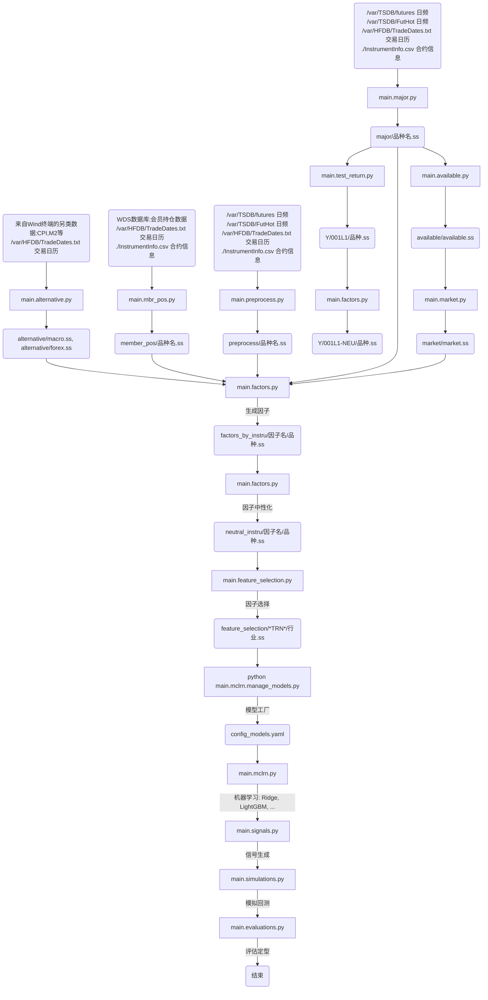
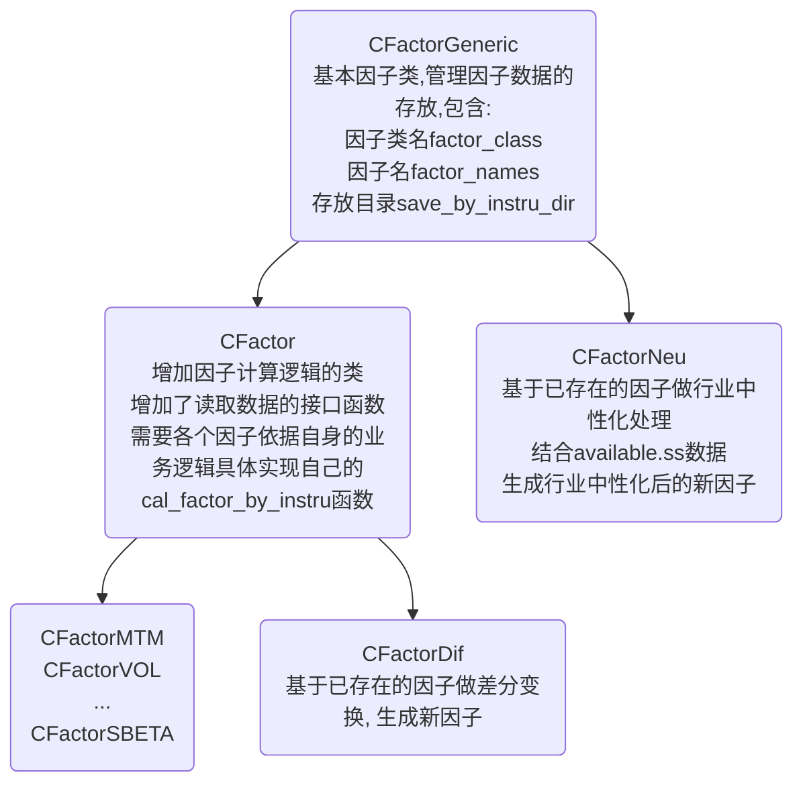

# CTA框架

## 摘要

### 模块说明

+ 按品种计算主力合约复权数据, 由`main.major.py`完成
+ 另类数据, 由`main.alternative.py`完成
+ 按品种生成会员持仓数据, 由`main.mbr_pos.py`完成
+ 按品种生成辅助数据, 由`main.preprocess.py`完成
+ 生成活跃品种池, 由`main.available.py`完成
+ 生成市场与行业收益, 由`main.market.py`完成
+ 计算各类基本因子, 由`main.factors.py`完成
+ 自定义未来收益/预测目标, 由`main.test_return.py`完成
+ 因子选择, 由`main.feature_selection.py`完成
+ 模型配置, 由`main.mclrn.manage_models.py`完成
+ 模型训练, 由`main.mclrn.py`完成
+ 信号生成, 由`main.signals.py`完成
+ 模拟回测, 由`main.simulations.py`完成
+ 评估定型, 由`main.evaluations.py`完成

### 框架流程



## 详细说明

### 生成另类数据: **`main.alternative.py`**

0. 生成人民币兑美元汇率数据, CPI数据, PPI数据和M2数据
1. 核心输入
    + Wind金融终端, 提供由Wind整理的相关数据, 主要包含以下两个文件
        + **`/home/huxo/Deploy/Data/Macro/china_cpi_ppi_m2.xlsx`**
        + **`/home/huxo/Deploy/Data/Forex/exchange_rate.xlsx`**
    + `/var/HFDB/TradeDates.txt` 用于查询交易日期, 并在增量更新时确保数据连续性
2. 核心计算
    + 人民币兑美元汇率是日频数据, 提供该汇率的日K线级别的数据.
    + CPI, PPI和M2数据按月公布, 通常在T月中旬公布T-1月数据, 为避免未来函数效应, 已将该数据**按照延迟2月对齐**, 然后以日频形式保存. 即在T月使用的均是T-2月的数据.
3. 核心输出
    + 人民币兑美元汇率数据 `/var/data/StackData/futures/team/huxo/alternative/forex.ss`

        ```python
        [
            ("tp", np.int64),
            ("trading_day", np.int32),
            ("preclose", np.float64),
            ("open", np.float64),
            ("high", np.float64),
            ("low", np.float64),
            ("close", np.float64),
            ("pct_chg", np.float64),  # 汇率相较前一日变化百分比
        ]
        ```

    + CPI, PPI和M2数据 `/var/data/StackData/futures/team/huxo/alternative/macro.ss`

        ```python
        [
            ("tp", np.int64),
            ("trading_day", np.int32),
            ("cpi_rate", np.float32),  # CPI数据, 已自动延迟2个自然月
            ("ppi_rate", np.float32),  # PPI数据, 已自动延迟2个自然月
            ("m2_rate", np.float32),  # M2数据, 已自动延迟2个自然月
        ]
        ```

4. 用法示例
    + 计算指定时间段数据

        ```bash
        python main.alternative.py --bgn 20120104 --end 20240308
        ```

    + 完成历史数据计算后, 每日增量更新, 写入时会自动对数据连续性进行检查.

        ```bash
        python main.alternative.py --bgn 20240311
        ```

### 按品种生成会员持仓数据: **`main.mbr_pos.py`**

0. 按品种生成会员持仓数据
1. 核心输入
    + WDS数据库, 提供由Wind整理的来自交易所的会员持仓数据
    + `/var/HFDB/TradeDates.txt` 用于查询交易日期, 并在增量更新时确保数据连续性
    + `./InstrumentInfo.csv` 提供各品种的基本信息
2. 核心计算
    + 修正郑商所代码只有三位的问题
    + 按照品种保存为.ss格式数据
3. 核心输出
    + 按品种保存
    + 保存路径 `/var/data/StackData/futures/team/huxo/pos_mbr/{品种}.ss`
    + 输出数据

        ```python
        [
            ("tp", np.int64),
            ("trading_day", np.int32),
            ("ticker", "S8"), # 合约代码, 郑商所合约已依据时间调整为4位,
            ("info_type", np.int32), # 会员持仓数据类型: 1=成交量;2=持买单量;3=持卖单量
            ("info_rank", np.int32), # 该会员在该合约上的该类型数据的排名, 通常是前20名.
            ("member", "S24"), # 会员名称,24字节,utf-8解码后对应最多8个中文字符
            ("info_qty", np.int32), #  该会员在该合约上的该类型数据的具体取值
            ("info_qty_dlt", np.int32), # info_qty 相较前一交易日变化情况
        ]
        ```

    + **额外说明**
        + 该文件不是严格时序文件, 同一个时间戳"tp"通常对应多条记录. 同一交易日, 由合约、数据类型、会员等要素定义了多条数据.
        + 该文件也不是严格连续的, 因为交易所只公布满足一定标准的合约的相关情况, 当品种(合约)不满足条件交易所设定的标准时, 交易所不会公布相应的数据.
        + 该数据在2020年之前, **不需要**对单双边进行调整.

4. 用法示例
    + 计算指定时间段数据

        ```bash
        python main.mbr_pos.py --bgn 20120104 --end 20240308
        ```

    + 完成历史数据计算后, 每日增量更新, 写入时会自动对数据连续性进行检查, 对一个品种而言, 该数据不是每日都有, 因此检查时只会检查新插入数据是否和已有数据重复, 对于新数据和已有数据中间缺失几天的情况, 不会报错.

        ```bash
        python main.mbr_pos.py --bgn 20240311
        ```

### 按品种生成辅助数据: **`main.preprocess.py`**

0. 按品种生成主力(近月), 次主力(远月)合约行情, 基差, 注册仓单等数据
1. 核心输入
    + `/var/TSDB/FutHot` 用于查找主力合约当日行情信息
    + `/var/TSDB/futures` 用于查找次主力合约当日行情信息
    + `/var/HFDB/TradeDates.txt` 用于查询交易日期, 并在增量更新时确保数据连续性
    + `./InstrumentInfo.csv` 提供各品种的基本信息
    + **`/home/huxo/Deploy/Data/Futures/by_date`** 提供按日下载整理的基差, 注册仓单等信息
2. 核心计算
    + 基于`/var/TSDB/FutHot` 给出的主力计算次主力(近月)合约
        + 若FutHot中有主力合约则使用, 否则利用`/var/TSDB/futures`选取当日成交量+持仓量最大的品种作为主力(近月)合约
        + 主力合约确定后, 在到期日晚于主力合约的合约中选取成交量加持仓量最大的合约作为次主力(远月)合约
        + 若无,即主力合约是最晚的合约, 则在到期日早于主力合约的合约中选取成交量加持仓量最大的合约, 将其作为新的主力(近月)合约, 然后将原来的主力合约当作次主力(远月合约)
    + 基差类数据, 来自Wind Terminal
        + 基差   `basis =` 现货 - 期货
        + 基差率 `basis_rate =` $\frac{现货 - 期货}{现货}$
        + 年化基差率 `basis_rate_annual =` $\frac{基差率}{到期日期} \times 250 $, 仅股指期货提供
    + 注册仓单数据, 来自WDS
        + `in_stock_total` 库存合计, 库存商品现有总数量
        + `in_stock` 注册仓单, 期货商品检测入库后开具的标准仓单量
        + `available_in_stock` 可用库容量, 实际库存-在途库存
3. 核心输出
    + 按品种保存
    + 保存路径 `/var/data/StackData/futures/team/huxo/preprocess/{品种}.ss`
    + 输出数据

        ```python
        [
            ("tp", np.int64),
            ("trading_day", np.int32),
            ("ticker", "S8"), # 主力(近月)合约代码, 郑商所合约已依据时间调整为4位, 即"CF405"->"CF2405"
            ("ticker_minor", "S8"), # 次主力(远月)合约代码, 格式同上

            # 主力(近月)合约行情
            ("preclose", np.float64),
            ("open", np.float64),
            ("high", np.float64),
            ("low", np.float64),
            ("close", np.float64),
            ("vol", np.float64),
            ("amount", np.float64),
            ("oi", np.int32),

            # 次主力(远月)合约行情
            ("preclose_minor", np.float64),
            ("open_minor", np.float64),
            ("high_minor", np.float64),
            ("low_minor", np.float64),
            ("close_minor", np.float64),
            ("vol_minor", np.float64),
            ("amount_minor", np.float64),
            ("oi_minor", np.int32),

            # 基差
            ("basis", np.float64),
            ("basis_rate", np.float64),
            ("basis_rate_annual", np.float64),

            # 注册仓单
            ("in_stock_total", np.float32) # 使用float格式, 以便严格区分0和nan的情况
            ("in_stock", np.float32)
            ("available_in_stock", np.float32)
        ]
        ```

4. 用法示例
    + 计算指定时间段数据

        ```bash
        python main.preprocess.py --bgn 20120104 --end 20240308
        ```

    + 完成历史数据计算后, 每日增量更新, 写入时会自动对数据连续性进行检查

        ```bash
        python main.preprocess.py --bgn 20240311
        ```

### 按品种生成主力合约复权数据: **`main.major.py`**

0. 按品种生成主力合约连续数据, 以及价格复权数据
1. 核心输入
    + `/var/TSDB/FutHot` 用于查找主力合约当日行情信息
    + `/var/HFDB/TradeDates.txt` 用于查询交易日期, 并在增量更新时确保数据连续性
    + `./InstrumentInfo.csv` 提供各品种的基本信息
2. 核心计算
    + 郑商所合约代码修正
    + 成交额调整为万元位单位
    + 成交量, 成交额, 持仓量在20200101前后单双边口径处理
    + 基于收盘价的主力合约日收益率
    + 主力合约前复权后的高开低收数据
3. 核心输出
    + 按品种保存
    + 保存路径 `/var/data/StackData/futures/team/huxo/major/{品种}.ss`
    + 输出数据

        ```python
        [
            ("tp", np.int64), 
            ("trading_day", np.int32),
            ("ticker", "S8"), # 合约代码, 郑商所合约已依据时间调整为4位, 即"CF405"->"CF2405"
            ("preclose", np.float64),
            ("open", np.float64),
            ("high", np.float64),
            ("low", np.float64),
            ("close", np.float64),
            ("vol", np.float64),
            ("amount", np.float64),
            ("oi", np.int32),
            ("major_return", np.float64),
            ("openM", np.float64), # 该品种复权后当日开盘价
            ("highM", np.float64), # 该品种复权后当日最高价
            ("lowM", np.float64), # 该品种复权后当日最低价
            ("closeM", np.float64), # 该品种复权后当日收盘价
        ]
        ```

4. 用法示例
    + 计算指定时间段数据

        ```bash
        python main.major.py --bgn 20120104 --end 20240308
        ```

    + 完成历史数据计算后, 每日增量更新, 写入时会自动对数据连续性进行检查

        ```bash
        python main.major.py --bgn 20240311
        ```

### 生成活跃品种池: **`main.available.py`**

0. 依据主力合约表现, 逐日确定成交活跃的品种, 并标注所属行业. 目前标准是过去5日(单边)日均成交额超过5万元的品种.
1. 核心输入
    + `/var/data/StackData/futures/team/huxo/major/{品种}.ss` 主力合约日频数据
    + `/var/HFDB/TradeDates.txt` 用于查询交易日期, 并在增量更新时确保数据连续性
2. 核心计算
    + 计算每个品种过去5日(单边)日均成交额
    + 为每个品种标注所属行业板块
3. 核心输出
    + 保存路径 `/var/data/StackData/futures/team/huxo/available/available.ss`
    + 输出数据

        ```python
        [
            ("tp", np.int64),
            ("trading_day", np.int32),
            ("instrument", "S4"),
            ("return", np.float64), # 主力合约当日收益
            ("amount", np.float32), # 主力合约当日成交额,万元
            ("sectorL0", "S4"), # 品种所属大板块, "C":商品 "F":金融
            ("sectorL1", "S4"), # 品种所属大板块, 商品分为["GLD", "MTL", "BLK", "CHM", "OIL", "AGR"], 金融目前仅有分类["EQT"]
        ]
        ```

    + **额外说明**
        + 该文件不是严格时序文件, 同一个时间戳"tp"通常对应多条记录, 即该交易日按照指定标准筛选出的活跃品种.
        + 该文件是严格连续的, 自2012-01-10日起, 每一个交易日应该都有数据

4. 用法示例
    + 计算指定时间段数据

        ```bash
        python main.available.py --bgn 20120104 --end 20240308
        ```

    + 完成历史数据计算后, 每日增量更新, 写入时会自动对数据连续性进行检查.

        ```bash
        python main.available.py --bgn 20240311
        ```

### 生成市场与行业收益: **`main.market.py`**

0. 计算成交额加权的市场收益, 行业收益.
1. 核心输入
    + `/var/data/StackData/futures/team/huxo/available/available.ss` 市场活跃品种日行情
    + `/var/HFDB/TradeDates.txt` 用于查询交易日期, 并在增量更新时确保数据连续性
2. 核心计算
    + 加权计算市场收益与行业收益
    + 品种权重与该品种主力合约日成交额的平方根成正比
3. 核心输出
    + 保存路径 `/var/data/StackData/futures/team/huxo/market/market.ss`
    + 输出数据

        ```python
        [
            ("tp", np.int64),
            ("trading_day", np.int32),
            ("market", np.float64), # 商品期货加金融期货收益
            ("C", np.float64), # 一级行业: 商品期货市场收益
            ("F", np.float64), # 一级行业: 金融期货市场收益
            ("GLD", np.float64), # 二级行业: 贵金属行业收益
            ("MTL", np.float64), # 二级行业: 有色金属行业收益
            ("OIL", np.float64), # 二级行业: 油脂油料行业收益
            ("CHM", np.float64), # 二级行业: 石油化工行业收益
            ("BLK", np.float64), # 二级行业: 黑色系行业收益
            ("AGR", np.float64), # 二级行业: 农副产品行业收益
            ("EQT", np.float64), # 二级行业: 股指期货行业收益
        ]
        ```

    + **额外说明**
        + 该文件是严格时序文件, 每个交易日对应一行数据.

4. 用法示例
    + 计算指定时间段数据

        ```bash
        python main.market.py --bgn 20120104 --end 20240308
        ```

    + 完成历史数据计算后, 每日增量更新, 写入时会自动对数据连续性进行检查.

        ```bash
        python main.market.py --bgn 20240311
        ```

### 各类基本因子: **`main.factors.py`**

0. 计算成交额加权的市场收益, 行业收益.
1. 核心输入
    + `/var/data/StackData/futures/team/huxo/major/*.ss` 品种主力合约数据
    + `/var/data/StackData/futures/team/huxo/alternative/*.ss` 汇率, CPI
    + `/var/data/StackData/futures/team/huxo/mbr_pos/*.ss` 会员持仓数据
    + `/var/data/StackData/futures/team/huxo/preprocess/*.ss` 近月合约,远月合约
    + `/var/data/StackData/futures/team/huxo/market/*.ss` 市场与行业收益
    + `/var/HFDB/TradeDates.txt` 用于查询交易日期, 并在增量更新时确保数据连续性
2. 核心计算
    + 目前的因子大类分为

      ```python
      ["VOL", "RVOL", "SKEW", "CV", "CTP", "CVP", "CSP", "RS"]
      ["CBETA", "S0BETA", "S1BETA", "IBETA", "PBETA", "VAL"]
      ["MTM", "HR", "SR", "SIZE", "LIQUID", "BASIS", "TS", "NOI", "NDOI", "WNOI", "WNDOI"]
      ```

3. 核心输出
    + 保存路径
        原始因子按照**品种**保存数据
            + 路径示例 `/var/data/StackData/futures/team/huxo/factors_by_instru/MTM/{品种}.ss`
        中性化后按照**品种**保存数据
            + 路径示例 `/var/data/StackData/futures/team/huxo/neutral_by_instru/MTM/{品种}.ss`
    + 输出数据

        ```python
        [
            ("tp", np.int64),
            ("trading_day", np.int32),
            ("ticker", "S8"),
            ("factor_name_0", np.float64), # 因子0
            ("factor_name_1", np.float64), # 因子1
            ("factor_name_2", np.float64), # 因子2
            ...
        ]
        ```

    + **额外说明**
        + 该文件是严格时序文件, 每个交易日对应一行数据.

4. 用法示例
    + 计算指定时间段数据, 以计算因子MTM为例.

        ```bash
        python main.factors.py --factor MTM --bgn 20120104 --end 20240308
        ```

    + 完成历史数据计算后, 每日增量更新, 写入时会自动对数据连续性进行检查.

        ```bash
        python main.factors.py --factor MTM --bgn 20240311
        ```

5. 因子类继承关系



### 自定义未来收益与预测目标: **`main.test_return.py`**

0. 计算成交额加权的市场收益, 行业收益.
1. 核心输入
    + `/var/data/StackData/futures/team/huxo/major/*.ss` 品种主力合约数据
    + `/var/data/StackData/futures/team/huxo/available/available.ss` 市场活跃品种日行情, 在对收益进行计算行业中性化时使用
    + `/var/HFDB/TradeDates.txt` 用于查询交易日期, 并在增量更新时确保数据连续性
2. 核心计算
    + 计算未来win日收益, 并延迟lag天, 标记为

    ```python
        f"{win:03d}L{lag}"
    ```

    + 在T日收盘后, 给定价格类型(Open或Close)计算该类型价格, T+1日到T+2日的收益, 并将其标记为T, 然后保存. 注意**不是T日到T+1日**.
    + 将上一步的结果按照行业中性化处理.

3. 核心输出
    + 以参数$(win=1,lag=1)$为例
    + 原始收益保存路径 `/var/data/StackData/futures/team/huxo/Y/001L1/*ss`
    + 行业中性化后的收益保存路径 `/var/data/StackData/futures/team/huxo/Y/001L1-NEU/*ss`
    + 输出数据

        ```python
        [
            ("tp", np.int64),
            ("trading_day", np.int32),  # T日
            ("ticker", np.float64),
            ("CloseRtn001L1", np.float64), # Close[T+1] -> Close[T+2] 的收益 
            ("OpenRtn001L1", np.float64),  # Open[T+1] -> Open[T+2] 的收益
        ]
        ```

    + **额外说明**
        + 该文件是严格时序文件, 每个交易日对应一行数据.
        + **`CloseRtn001L1`** **不是**通常的 **Close[T] -> Close[T+1]** 对应的收益

4. 用法示例
    + 计算指定时间段数据

        ```bash
        python main.test_return.py --bgn 20120104 --end 20240308 [--lag 1] [--win 1]
        ```

    + 完成历史数据计算后, 每日增量更新, 写入时会自动对数据连续性进行检查.

        ```bash
        python main.test_return.py --bgn 20240311 [--lag 1] [--win 1]
        ```
